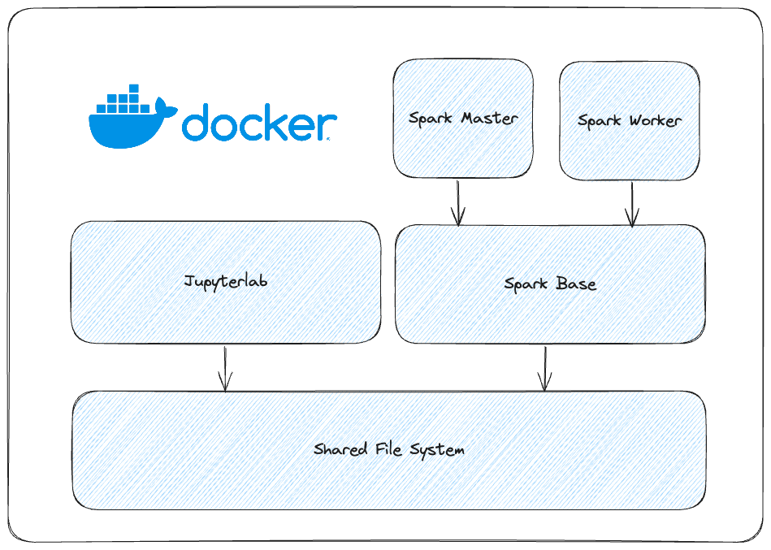
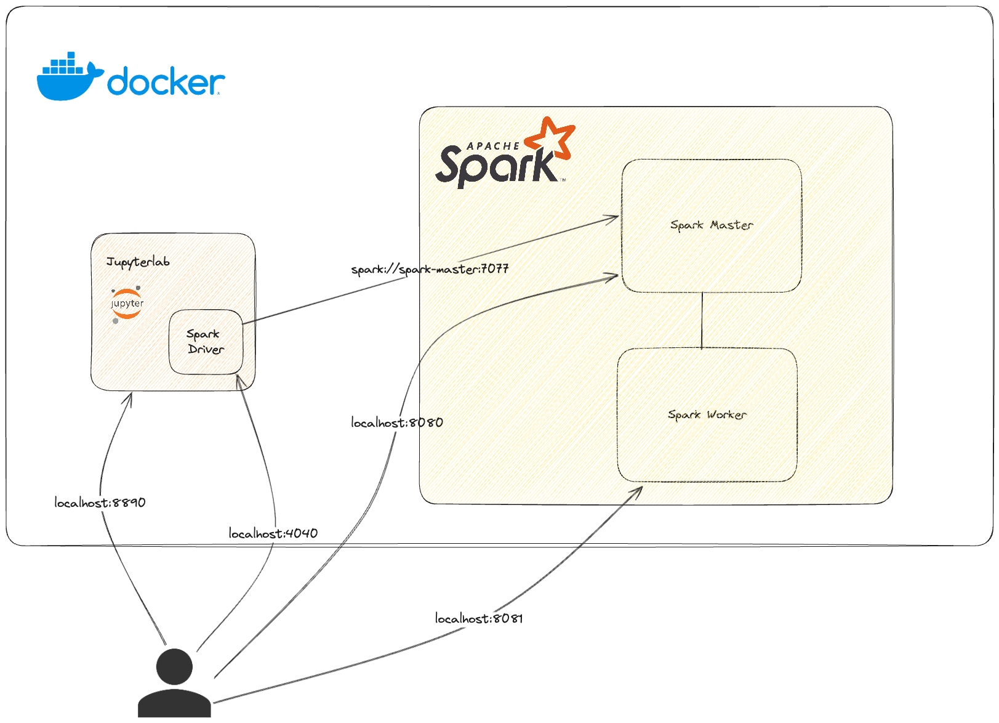

# Spark Infra Playground

## Docker Overview


## Architecture


## Run Infra

1. Open the folder with **Visual Studio Code**
2. (if windows) Open the file **build.sh** and in the botton right, change **CRLF** by **LF**, then with `git bash` run shell script.
3. Open a terminal
    ```shell
    sh build.sh
    ```
4. Run `docker-compose up`
5. Go to local [Jupyerlab](http://localhost:8890/tree?)