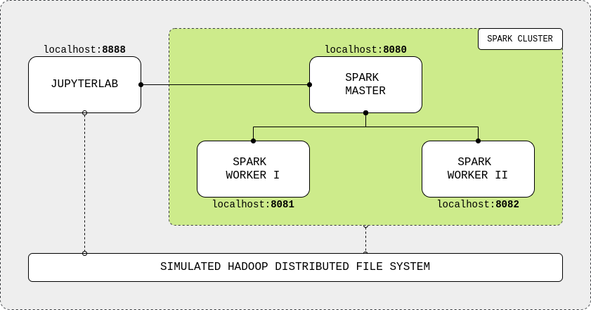

# spark-course



## Run

1. Open the folder with **Visual Studio Code**
2. (if windows) Open the file **build.sh** and in the botton right, change **CRLF** by **LF**
3. Open a terminal
```shell
sh build.sh
```
4. Go to local **http://localhost:8890/tree?**